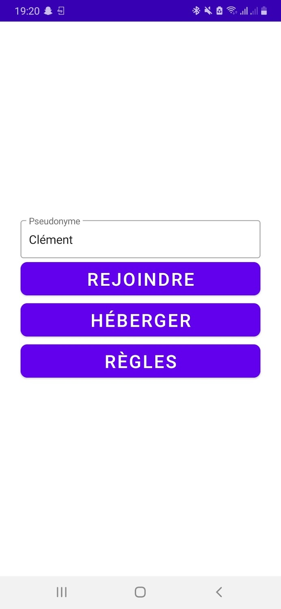
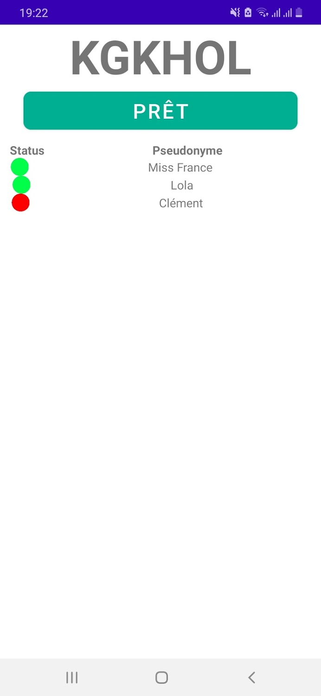
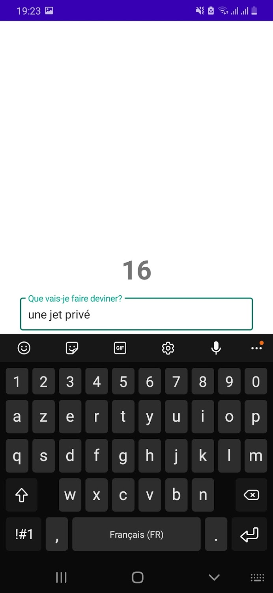
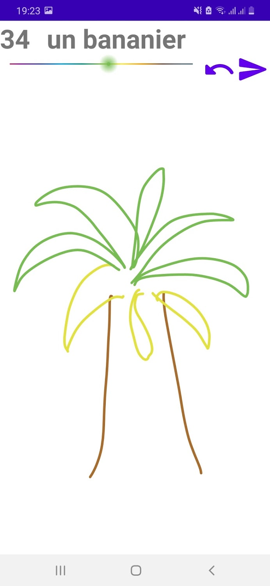
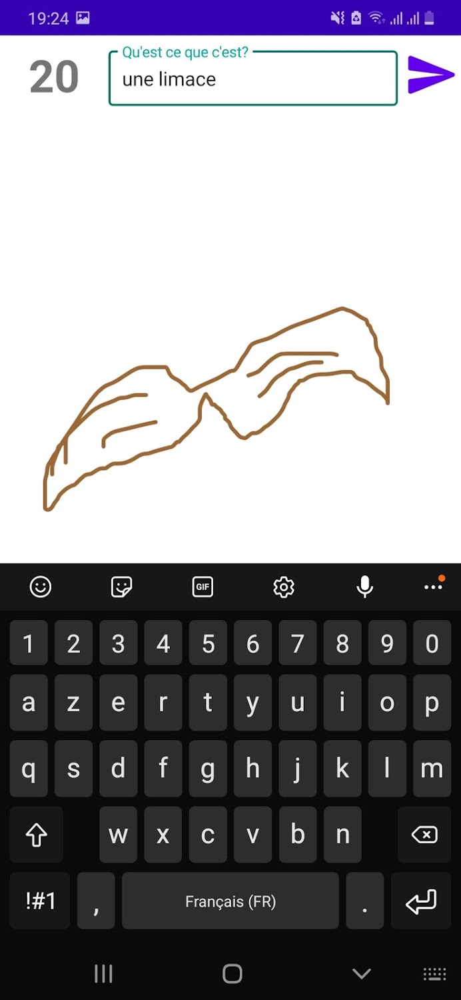
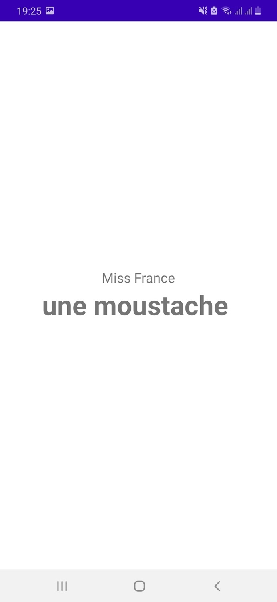
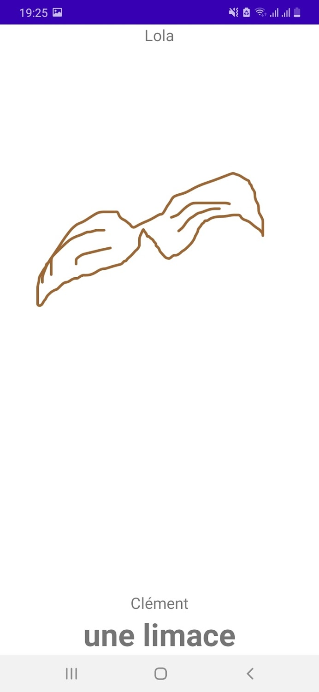

# IUT-2A-Java-ProjetAndroid-DessineIt

Ce projet a été réalisé en parralèle avec le module Android de l'IUT informatique des Cézeaux.

## Présentation application DessineIt

Présentation application DessineIt 
 
Cette application est un jeu de téléphone arabe. On peut le considérer comme une adaptation mobile du site web GarticPhone (https://garticphone.com/fr). 
 
Les règles sont simples : 
*	On rassemble les joueurs.  
*	Chaque joueur choisit un mot/phrase 
*	Le suivant doit la dessiner 
*	Le prochain doit deviner ce qu’était la phrase du premier joueur, en se basant uniquement sur le dessin. 
*	Etc jusqu’à ce que les expressions aient tournées entre les mains de tous les joueurs. 
*	Enfin, on affiche les résultats pour constater les déformations qu’il y a pu y avoir. 
 
Le contexte de notre application est donc de faire une version mobile de ce jeu. 
 
## Commentaire sur le travail effectué

L’application fonctionne correctement lorsque toutes les conditions sont optimales. En effet, lors d’une partie, nous ne sommes pas à l’abri d’un dysfonctionnement si la connexion d’un joueur est hésitante. De plus, si un joueur quitte la partie, cela bloque le déroulement du jeu (Nous sommes proches de régler ce problème, c’est pour cette raison que nous avons changé bon nombre d’activités en fragments. Notre objectif était que si un joueur quitte cela mette fin à la partie. Certes ce n’est pas formidable d’un point de vue de la jouabilité, mais le temps nous a cruellement manqué. 
Autre souci, nous n’avons pas de gestion des données. Autrement lorsqu’une partie se déroule, les images et les données qui ont pu s’échanger restent sur Firebase. Pour cela nous aurions dû faire un serveur ou une entité tierce capable de gérer les ressources des serveurs mais nous avions d’autres objectifs plus importants à régler. A long terme cela aura pour conséquence de remplir notre espace de stockage donc cela reste un problème qu’il faut régler. 
Enfin nous aurions aimé ajouter un mode de jeu qui permettait de jouer avec plusieurs téléphones en se les passant physiquement (au cas où tout le monde n’est pas de téléphone Android à disposition). Nous étudierons cet aspect du jeu dans un second temps peut-être. 
 
Pour le reste, nous sommes satisfaits du travail. Notre diagramme de classes nous a paru un peu maladroit mais au moins l’application fonctionne et nous avons pu réaliser de vraies parties dont les bêta-testeurs ont apprécié prendre part. 
 
Voici un lien YouTube d’une partie simulée puisque vous ne pourrez peut-être pas tester par vous-même l’application.  
https://www.youtube.com/watch?v=hrj-bawHW4A 

## Lien GooglePlay

https://play.google.com/store/apps/details?id=iut.cours.tp

### Partie interressantes du projet

* Firebase (Storage, Real-Time)
* Paint view et gestion du dessin de l'utilisateur
* Fragments

### Images disponibles sur Google Play

