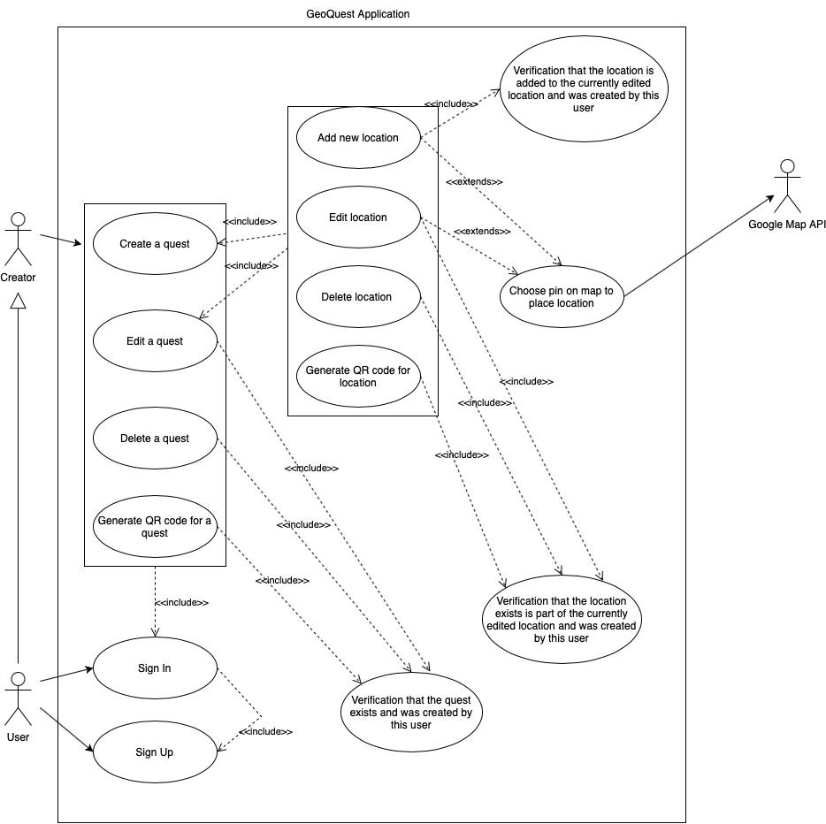
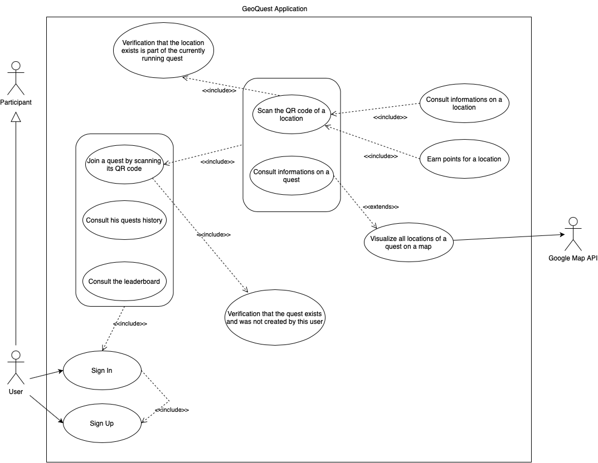
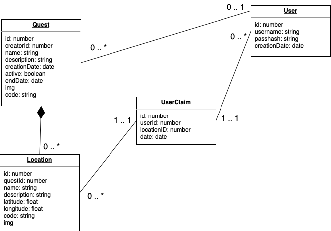

# GeoQuest Documentation

## Project Purposes

GeoQuest is a React native application mainly made for IOS users. It is a game, where users can create and participate to quests. 
Creators hide QR codes in the real world and report the location of thoses on the application, only for the participants to find them and win points. 

This project was made for a WEB course of an Engineering School (ENSIMAG). The goal of this project was to do a web full stack application in small groups of 1 to 3 students. This project and course were made for students to learn about the main concepts of React Native web/mobile apps.
Therefore the application respect the following instructions:
- Use of node and express frameworks for the backend.
- Use of React Native for the frontend.
- Management of different user roles with different rights (quest creators and quest participants).
- Sets of tests for the backend (with swagger and unit tests).
- Sets of functional tests (with Cypress).
- Use of at least one external API
- CI/CD (optional)

## Use Cases
There is only one type of user. There is no admin in our application. 
The different user's rights on a quest depends on the link that has the user to the quest (creator or participant).

### The general user
---
* A user should be able to Sign Up to the application and create an account.
* A user can only use the app functionnalities once Signed In.
* A signed in user can both be a creator and a quest participant.
* A user's account should allow the user to find both his current quests participations and active quest creations.

### The user as a Quest Creator
---
* A user should be able to create quests, give them a name, a description and an expiration date. 
* A user should be able to activate or desactivate a quest in order to allow other users to participate to it or not. 
* A user should be able to add new locations to a quest, give them a name, a description and place them on a map.
* A user should be able to generate and save the locations QR codes before printing and hiding it by themselves to the proper GPS location.
* A user should be able to edit or delete quests already created. 
* A user should be able to share its quest to other players.
* A user should be able to edit or delete locations already created associated to a quest.
* A user should be able to generate and share the code or the QR code of the quests they created.

### The user as a Quest Participant
---
* A user should be able to join quests on which he is not the creator by entering a code or scanning a qrcode shared by the creator.
* A user should be able to see easely the name and the description of the quests he had joined.
* A user should be able to scan locations QR codes and win associated points.
* A user should be able to follow its accomplishments on a quest.
* A user should be able to see pins of hidden locations of a quest on a map in order to find the QR codes. 
* A user should be able to see locations names and descriptions once found.
* A user should be able to see the history of the quets he participated to even when the quets are not active anymore.
* A user should be able to see easily the users leaderboard and their rank to compare its accomplishments to others.
* A user should be able to quit and delete quests that he has joined.


## Usage Scenario (Use Case Diagrams)
A user is both a creator and a participant to quests but has different rights on a quest depending on its link to it. 

This diagram explains the rights of a user as the creator of a quest.


This diagram explains the rights of a user as a participant to a quest. 


## Data Model
### Frontend data model
---
The data model used for the frontend part is explained on [the project architecture part.](#app)

### Backend data model
---
UML Diagramm to illustrate the data model used for the backend of this application.


#### Verify credentials of user using the username and password. Return a token

  POST /api/signin


| Parameter | Type     | Description                |
| :-------- | :------- | :------------------------- |
| username | string | Required. The username of the user |
| password | string | Required. The password of the user |

##### Responses

  - 200 : Sign in succeed
  - 400 : Wrong arguments (missing username or password)
  - 403 : Invalid username or password

#### Create a new user. Return a token

  POST /api/signup


| Parameter | Type     | Description                |
| :-------- | :------- | :------------------------- |
| username | string | Required. Your username |
| password | string | Required. Your password |

##### Responses

  - 200 : Sign up succeed
  - 400 : Wrong arguments (missing username or password)
  - 403 : Username already taken

### Quest

#### Create a new quest

  POST /api/addquest


| Parameter | Type     | Description                |
| :-------- | :------- | :------------------------- |
| userId | string | Required. The id of the user |
| name | string | Required. The name of the quest |
| description | string | Required. The description of the quest |
| enddate | string | Optional. The end date of the quest |

##### Responses

  - 200 : OK. Return the created quest
  - 400 : Invalid arguments (missing userId, name or description)
  - 403 : User does not exist

#### Get some quests by their codes. If some codes are invalid, they are ignored

  POST /api/getquests


| Parameter | Type     | Description                |
| :-------- | :------- | :------------------------- |
| codes | array[string] | Optional. Codes of quests |

##### Responses

  - 200 : OK. Return the quests
  - 400 : Invalid arguments (missing codes)

#### Edit a quest

  PUT /api/editquest


| Parameter | Type     | Description                |
| :-------- | :------- | :------------------------- |
| userId | string | Required. The id of the user |
| questId | string | Required. The id of the quest |
| name | string | Optional. The name of the quest |
| description | string | Optional. The description of the quest |
| active | string | Optional. The active state of the quest |
| img | string | Optional. The image of the quest |
| enddate | string | Optional. The end date of the quest |

##### Responses

  - 200 : OK. Return the updated quest
  - 400 : Invalid arguments (missing userId or questId)
  - 403 : User is not the owner or the quest does not exist

#### Delete a quest

  DELETE /api/deletequest


| Parameter | Type     | Description                |
| :-------- | :------- | :------------------------- |
| userId | string | Required. The id of the user |
| questId | string | Required. The id of the quest |

##### Responses

  - 200 : OK. Delete quest
  - 400 : Invalid arguments (missing userId or questId)
  - 403 : User is not the owner or the quest does not exist

### Location

#### Returns the locations associated to a quest

  GET /api/getlocations/${questId}


| Parameter | Type     | Description                |
| :-------- | :------- | :------------------------- |
| questId | string | Required. The id of the quest |
| userId | string | Optional. The id of the user |

##### Responses

  - 200 : OK. Return the locations
  - 400 : Invalid arguments (missing questId)
  - 403 : The quest or user does not exist

#### Claim a location

  POST /api/claimlocation


| Parameter | Type     | Description                |
| :-------- | :------- | :------------------------- |
| userId | string | Required. The id of the user |
| code | string | Required. The id of the location |

##### Responses

  - 200 : OK. Claim location
  - 400 : Invalid arguments (missing userId or code)
  - 403 : The user, quest, location does not exist, the quest is inactive, the location is already claimed or the owner cannot claim his location

#### Create a location associated to a quest

  POST /api/addlocation


| Parameter | Type     | Description                |
| :-------- | :------- | :------------------------- |
| questId | string | Required. The id of the quest |
| name | string | Required. The name of the location |
| description | string | Required. The description of the location |
| latitude | string | Required. The latitude of the location |
| longitude | string | Required. The longitude of the location |

##### Responses

  - 200 : OK. Return the location
  - 400 : Invalid arguments (missing questId, name, description, longitude or latitude)
  - 403 : The quest does not exist

#### Remove a location

  DELETE /api/removelocation


| Parameter | Type     | Description                |
| :-------- | :------- | :------------------------- |
| locationId | string | Required. The id of the location |
| userId | string | Required. The id of the user |

##### Responses

  - 200 : OK. Remove the location
  - 400 : Invalid arguments (missing locationId or userId)
  - 403 : The location or user does not exist, the user is not the owner of the quest or the quest is active

### Scoreboard

#### Returns last locations associated to a user

  GET /api/getlocationhistory/${userId}


| Parameter | Type     | Description                |
| :-------- | :------- | :------------------------- |
| userId | string | Required. The id of the user |

##### Responses

  - 200 : OK. Return locations
  - 400 : Invalid arguments (missing userId)
  - 403 : The user does not exist

#### Get score of a player

  GET /api/getscore/${userId}


| Parameter | Type     | Description                |
| :-------- | :------- | :------------------------- |
| userId | string | Required. The id of the user |

##### Responses

  - 200 : OK. Return score
  - 400 : Invalid arguments (missing userId)
  - 403 : The user does not exist

#### Returns rank of player

  GET /api/getrank/${userId}


| Parameter | Type     | Description                |
| :-------- | :------- | :------------------------- |
| userId | string | Required. The id of the user |

##### Responses

  - 200 : OK. Return rank
  - 400 : Invalid arguments (missing userId)
  - 403 : The user does not exist

#### Returns the ${limit} top players. Limit must be between 1 and 25

  GET /api/getranking/${limit}


| Parameter | Type     | Description                |
| :-------- | :------- | :------------------------- |
| limit | string | Required. The id of the user |

##### Responses

  - 200 : OK. Return ranking
  - 400 : Invalid arguments (missing limit)

## Technical choices 

### Webservices used
---

For the backend of our project, we used Node.Js with the [Express](https://expressjs.com/) framework.
Express is a minimalist library for handling client requests on a node server. This simplifies and structure the project. Express helps you to handle routing, error, and middleware setup easily.

We've managed to build a backend that's simply deployable on Scalingo. You can check the documentation here on [Scalingo](https://geoquest.osc-fr1.scalingo.io/doc/).

### Roles
---

We met a technical challenge during our project.

The `Location` is identified using an ID. Claiming a location means having an endpoint that takes as argument the `Location_id` and the `User_id`. Unfortunatly, because `Location_id` is incremented every new location creation, it's easy for a cheater to know which `Location_id` correspond to a specific `Location`.

In order to limit cheating, we decided that only the owner of a location could access to its `Code`. The `Code` is a random sequence of alpha-numerical characters. The amount of different codes make it impossible for a cheater to brute force the claim endpoint with valid codes.

`Code` are stored in QR codes. The only way to get the `Code` is to scan hidden QR. We also wanted to add a position check ot prevent user claiming from a different position. We did not have the time to do this. 

Providing a `userId` and a `password` to this endpoint means you ensure that it is yours. Because it's yours, you can access the location `Code` and generate the associated QR Code.

This process is imperfect. we would have preferred to set up temporary connection keys used to identify users, but we didn't have the time.

### Project architecture
---

In the monorepo whe have two different projects:

**`/app` :** The react-native application

**`/back` :** The backend of our application

Let's talk about the `/app` project.

#### App

This is a quick summary of what the `/app` project contains.

/ | Description 
--- | --- 
`assets` | Assets used into the application.
`components` | Components of the project.
`cypress` | E2E tests.
`hooks` | Common hooks.
`mappers` | Mappers turning database object into object from our model.
`page` | Pages of the application.
`type` | Model type definition.
`utils` | All utils functions.

This is now the details of each folders.

---

- **`assets`**

This contains all ressources of our application. Actually all of this ressources are `.png` files. This folder also contains the `Assets.ts` file. 

The `Assets.ts` file exposes all ressources to the rest of the application. We used it like this.
```
import Assets from "../assets/Assets";

...
const asset = Assets.ASSET_NAME;
...
```
---
- **`components`**

The component folder contains every components of the application.

The components are not supposed to contain logic. The logic is in the `Page` hooks.

Some component are different depending on the plateform. For instance, the `Map` component imports an other component from `react-native-maps`. This component is adapted for Android/IOs but it won't work on the Web version. 
Simply importing the component into the Web version will result in an error.

To make the same component adapted for different plateforms, we used this template:
```
/MyComponent
    Component.ios.tsx
    Component.android.tsx
    Component.tsx
    type.ts
```

Using the notation `Component._platform_.tsx`, it allows to dynamically indicate which component variant to choose, depending on the runtime platform. This behavior is handled by `React-native`.

---
- **`cypress`**

We choosed [Cypress](https://www.cypress.io/app/) to test our application.
[Cypress](https://www.cypress.io/app/) allows end to end testing and components testing. We did not put in place the component because we were too short in time and our component were evolving very quickly.

During this project, we must use [Cypress](https://www.cypress.io/app/). It's a very powerfull tool for testing Web applications but we felt limited trying to test IOs and Android versions.

As explained in the `Component` section, we have different component variant depending on the execution plateform. We were not able to test the maps and scan components which represent the most critic part of our application.

---
- **`hooks`**

The `hooks` folder contains the common hooks used everywhere in our project.

It contains :

Hook name | Methods exposed | Description 
--- | --- | ---
`requestHook` | `request: (method, endpoint, data, token?, callBack?, errorCallBack?)` | Every request are sent using this hook. Were are using the [Fetch library](https://www.npmjs.com/package/node-fetch).
`storageHook` | `setItem: (key, value), getItem: (key, defaultValue?), removeItem: (key)` | This hook is an abstraction to access to plateform storage, we use the  [Async storage library](https://www.npmjs.com/package/@react-native-async-storage/async-storage)

---
- **`mappers`**

Mappers turn DTO into our model objects. DTO are obtained using our endpoints.

---
- **`page`**

Pages are containing both the components and the logic of our application tabs.

A page is represented like this :
```
/MyPage
    MyPage.tsx
    types.ts
    useMyPage.ts
```

`MyPage.tsx` contains all JSX Elements.

`types.ts` contains both component and hook tests.

`useMyPage.ts` contains all the logic of the pages.

We are using the [Dependency injection](https://fr.wikipedia.org/wiki/Injection_de_d%C3%A9pendances) design pattern for our hooks. Even if we did not have the time to test our hooks, our implementation provides for this type of evolution.

---
- **`types`**

This folder contains our model objects.

Type name | Description 
--- | --- 
`Location` |  Represents a location.
`Quest` |  Represents a quest.
`User` |  Represents the user.
`Claim` |  Represents when the user claims a QR Code
`PageProps` |  This file contains all `pages` names and base `page` props.

**Location**
```
type Location = {
    key: number; // Id
    xCoordinate: number; // Longitude
    yCoordinate: number; // Latitude
    title: string; // Location label
    description: string;
    img?: string, // Url
    code?: string; // Location secret code
}
```
**Quest**
```
type Quest = {
    id: number;
    creatorId: number;
    name: string;
    description: string;
    locations: Location[]; // All locations
    active: boolean; // If the quest is active
    code: string; // Quest code (to share)
    endDate?: string; // If enddate > current date, the quest is considered as inactive
    img?: string; // Url
}
```
**User**
```
type User = {
    id: number;
	username: string;
	password: string; // Hashed
	creationDate: number;
	claims: Claim[]; // What the user claimed
	quests: Quest[]; // All user quests
    token?: string; // User's token
}
```
**Claim**
```
type Claim = {
    id: number;
	location: Location; 
	date: number;
}
```
**PageProps**
```
// Base props are the props of every Pages
type BaseProps = {
    navigation: NavigationType,
    route?: {
        params?: any
    }
}
type NavigationType = {
    navigate: (route: string, params?: any) => void,
    goBack: () => void,
    push: (route: string, params?: any) => void,
}
```

---
- **`utils`**

This contains common methods.

Actually we only have `Avatar.ts` which associate the hash of an username to a specific avatar.

#### Back

This is a quick summary of what the `/back` project contains.

/back | Description 
--- | --- 
`log` | All the logs.
`src` | The express server code.

The `src` folder contains :
/back/src | Description 
--- | --- 
`__tests__` | All the tests.
`contants` | Endpoint names and other constants.
`controllers` | Data-access layer and logical layer.
`middleware` | Middleware.
`models` | Data model.
`routes` | Routing.
`util` | All utils.
`app.ts` | App setup.
`server.ts` | Server start.

---
- **`__tests__`**

Contains all the endpoints tests.

---
- **`contants`**

Contains the endpoints names.

---
- **`controllers`**

Contains all the logic and the data-access layer.

This is our controllers:

Controller name | Description 
--- | --- 
`location` | Location controller.
`quest` | Quest controller.
`scoreboard` | Scoreboard controller.
`user` | User controller.

---
- **`middleware`**

This folder contains the middlewares. 

Unfortunatly we did not implemented the token checker middleware. Everything in the codebase is ready but we lost time on other tasks and finnaly forgot.

---
- **`models`**

Contains the database model. We are talking about our model in an other section of the ReadMe.

---
- **`routes`**

All the server routes.

---
- **`util`**

All the util methods.

Method name | Description 
--- | --- 
`database.ts` | The database deployment.
`codeError.ts` | Error handling.
`logger.ts` | Logging.
`swagger.ts` | Swagger script.
`updatedb.ts` | Database script.

#### CI / CD

The pipeline will check back-end tests and front-end tests using jest and Cypress.

The branch `scalingo` implements a job to deploy project on Scalingo.

## Screencast of the app

[](https://youtu.be/J-qe3p2or-s "1. Screencast of GeoQuest 2023")

## Commentary
### Strong aspects
- The application is complexe and works. All use cases are checked, UI and UX are decent.
- The CRUD on quests/locations were such a pain to implement but it works.
- The application is well documented, the team understand the architecture of the project and the productivity improved a lot during the last days.
- The architecture would have difficulties to scale regarding the actual state of the project, but, it would not require that much work to make the structure very clean because we already followed some good practices.
### Weak aspects
- Middleware is missing
- The application is not very secure (password management, vulnerability to fuzing, spamming, etc.)
- Ths application works for sure on an IPhone 12 but it has not been tested on any other devices. The Web version does not for general use cases.
- Robustness, we lask tests and the use cases have never been tested in real conditions.
- Tests on hooks.
- CICD is not totally working.

### Evolutions
If we had the opportunity to improve our application we would focus on:
- Fixing all the weak points.
- Improving UX for the quest and location creation, allowing the user to create it's play zone by drawing the hidden QR code zone.
- Focus on the multiplayer aspect by providing more statistics and by allowing the user to backup its progress from other devices.
- Allow to save the QR codes to the gallery.
- Share Quests using a link instead of a raw code.
- Improve the Map and the game part we would like to display a progress bar on quests and also to differenciate claimed locations from others.

## Installation and Tests
### Introduction
---

To run the whole application please run the following commands :
```bash
// In terminal #1
cd ./back
yarn setup
yarn start

// In terminal #2
cd ./app
yarn install
yarn start
```

### Mobile App
---

The mobile application is in the `/app` package.

#### Configuration

`.env` file example :
```bash
BACKEND_API = 'http://localhost:3000/api/';
```

Before launching the project you should run :
```bash
yarn install
```

#### Execution

`start` : Run the application

`cypress` : Run cypress tests

`android` | `ios` | `web` : Run the application on a specific platform

`postinstall` : Fix some broken files in the react native dependencies

### Server
---

The backend of our application is in the `back` package.

#### Configuration

`.env` file example :
```bash
DB=bmt.sqlite
PORT=3000
SECRET=AAAAA
TOKENSECRET=BBBBBB
```

Before launching the project you should run :
```bash
yarn setup
```

#### Execution

`startdev` : Reset database, generate the documentation and run the server in dev mode

`start` : Run the server (production like)

`setup` : Download dependencies, generate the documentation and generate the database

`updatedb` : Update the database

`server` : Run the express server

`test` : Run all tests

## Authors 
+ Tiphaine Guereven
+ Clément Juventin
+ Evan Excoffier
